# neural-translation-transformer

RU-EN translation bases on Transformer model. It uses custom BPE tokenizer and 
gensim.Word2Vec model. 

## Models.

Transformer model bases on https://github.com/SamLynnEvans/Transformer

Attention head pruning bases on https://github.com/aiha-lab/Attention-Head-Pruning

Dataset is shortened version of RU-EN dataset from http://www.manythings.org/anki.

# Data

All data you can find here: https://drive.google.com/drive/folders/1zVsotEzUDgA-j1SHhBPVeehO_AiA5Lq7?usp=sharing

This link contains pre-learn models, tokenizers, w2v models, dataset and learning logs.
You can learn you own model, but dataset must be store in .tsv format, you also 
need to edit paths in **src/enums_and_constants/constants**.

# Training

## Tokenizer

First of all train you own tokenizer. Example:
```bash
python src/trainers/bpe-trainer.py
```
It will train and save source and target tokenizers bases on dataset.

## W2V model

After that you can train your own w2v model. You must train tokenizer before
w2v model cause it bases on tokens. Example:
```bash
python src/trainers/w2v-trainer.py
```
It will train and save source and target w2v models.

## Models

PyTorch Lightning used for model training. Each model trains 10 epoch with
early stop. You can tune model parameters in
**src/enums_and_constants/constants.py**.

### Full model

Use
```bash
python src/trainers/model-trainer.py --prune False
```
to train model without attention head pruning. 

### Prune model

Use
```bash
python model-trainer.py --prune False
```
to train model with attention head pruning. By default, l0 coefficient equals 0.005

## Training results

### Full model

Model train during 4 epochs till early stop. Here you can see train and validation plots of loss.

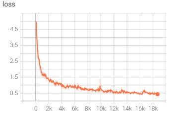


More information can be found in the training logs.

### Prune model

Model train during 7 epochs till early stop. Here you can see train and validation plots of loss.
It is sum of l0 and transformer losses.

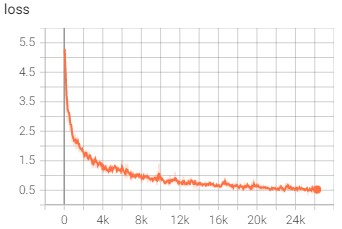
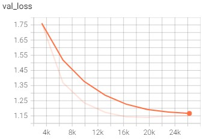

**l0_loss**

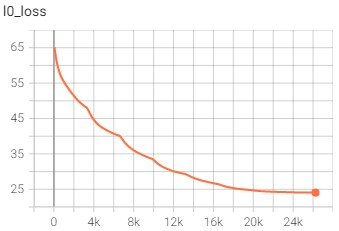
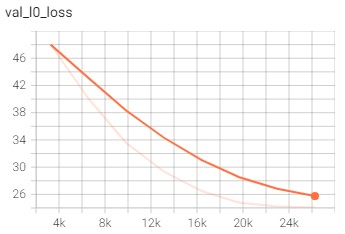

**transformer_loss**

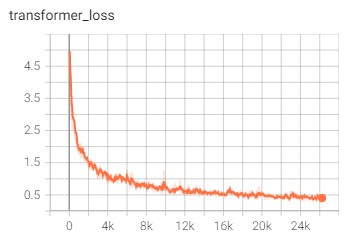
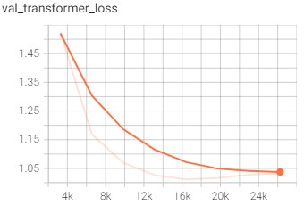

More information can be found in the training logs.

## Compute bleu score and eval model quality

You can estimate bleu score of models with command
```bash
python src/eval/compare_bleu_score.py
```

This script preload data from gdrive. Comment preload string if you want.

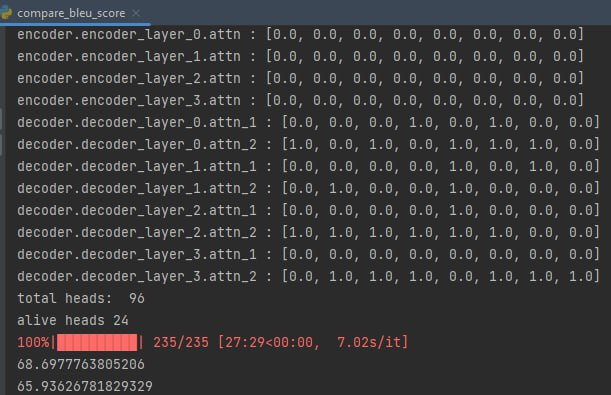

As you can see full model contains 96 heads, prune model contains 24. 
Quality of full model ~68.7, quality of prune model ~65.9. Such big values 
of bleu connected with the fact that dataset contains a lot of similar sentence.
An interesting fact is that the model decodes long sentences better than short ones.

## Telegram bot

If you have everything to inference model start you telegram bot. You only need to 
specify your secret in **src/enums_and_constants/constants.py** and run script
```bash
python src/telegram_bot/bot.py
```

Start work with bot with command **/start**.

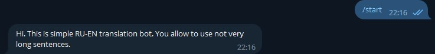

Ask for help with command **/help**.

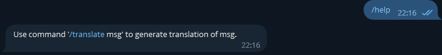

You can translate only RU sentences. 

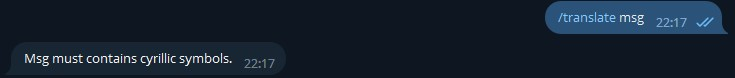

Too long messages are not allowed.

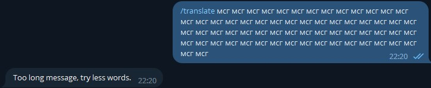

The model copes well with everyday phrases.

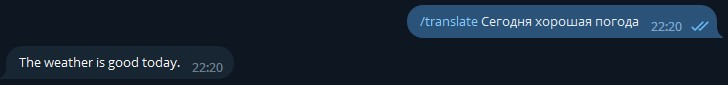

And with non-everyday.

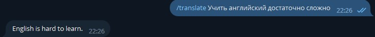

However, incidents happen, especially in very short phrases)

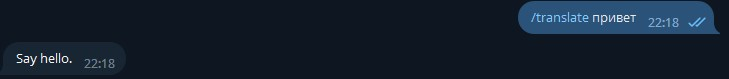

Please try to use the bot yourself and look for its weaknesses.